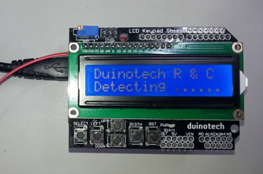
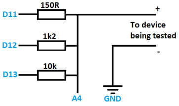
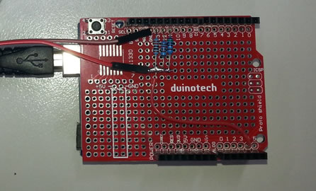

# Duinotech Resistor and Capacitor Tester

Here's another easy to build project similar to the LED  tester, and using the same hardware. This project will try to work out whether  it’s connected to a resistor or capacitor and then show you the value  (resistance or capacitance) of it. If it’s a resistor, it’ll also suggest the  nearest resistor from the Jaycar range of ½W resistors. Of course, using off  the shelf components, it’s not a high accuracy device, but handy to have if  you’re sorting through your junk drawer and are having trouble with the colour  codes. There’s about ten solder joins that need to be made to complete this  project.
If you've already built the LED tester, you can add the  components onto the same proto shield, as the circuits use different pins on  the Uno (but the same pins for the LCD).

## Components

|Qty| Code | Description |
|---|---|---|
|1 | [XC4410](http://jaycar.com.au/p/XC4410) | uno main board
|1 | [XC4482](http://jaycar.com.au/p/XC4482) | prototyping shield
|1 | [XC4454](http://jaycar.com.au/p/XC4454) | LCD controller shield
|1 | [RR0552](http://jaycar.com.au/p/RR0552) | 150 resistor
|1 | [RR0574](http://jaycar.com.au/p/RR0574) | 1k2 resistor
|1 | [RR0596](http://jaycar.com.au/p/RR0596) | 10k resistor
|1 | [WC6024](http://jaycar.com.au/p/WC6024) | plug plug jumper leads

The resistor values aren’t critical, but the smallest one  can’t be smaller than 125R as this will overload the Uno’s outputs. If you use  different values, check the notes in the code about the changes that need to be  made.

I used two plug-plug jumper cables as my probes, but you  could just use any small wire (eg speaker cable) that is lying around. You’ll  also need a small piece of wire to make a connection on the Protoshield.

## Connections

Apart from plugging the shields into the Uno, the hard part  is soldering the three resistors and probe leads onto the proto shield. See the  diagram and photo below.

Once the resistors and wire have been soldered together,  plug the Protoshield into the Uno, then plug the LCD Shield into the  Protoshield (they should only go one way).

## Code

There aren't any extra libraries that are needed for this  project as the 'LCD' and 'math' libraries are both included with the IDE. The  code should work fine without changes on a Leonardo or Mega board if you have  one of these instead.  If you’re using  different resistors, you’ll need to change the definitions of the R1VALUE,  R2VALUE or R3VALUE constants. You can also change the pins here too. The code  uses some of the functions from the LED tester sketch (such as the key  handling), but is mostly completely different.

## How it Works

The component detector works by putting 5V onto the 10k  resistor, and if A4 is anything but very close to 5V, then something is  connected and pulling the analog reading closer to GND.

The routine for working out if the component is a capacitor  or resistor works by assuming it is a capacitor, and discharging it (via 150R  resistor to GND), then measuring the voltage on it, then charging it up again  and measuring the voltage. If the voltage has changed, then it is a capacitor,  if it hasn’t changed, then it’s a resistor.

To measure a resistor, the three test resistors are each set  up as a voltage divider with the test resistor, and the voltage at the junction  measured. The resistor which gives a reading nearest 2.5V is chosen (as this will  give the best precision), and the resistor value is calculated using the  voltage divider formula: R2 = (R1 x V2)/V1. This routine exits when it detects  a very high resistance, assuming this means the test resistor has been  disconnected.

The capacitor tester starts by trying to discharge the  capacitor for half a second (the results are more accurate the less the  capacitor is charged). The voltage on it is measured, then it is charged from  5V via the 150R resistor for 0.1s, then the voltage on it is measured again.  The ratio between the two voltages gives the proportion of charge (towards  fully charged) it has received. When this is combined with the 0.1s time, the  time constant for the resistor-capacitor combination can be worked out, and  this is simply divided by the resistor value to give the capacitance value. If  the capacitor ends up nearly fully charge, then the measurement is not  completely accurate, and the test is redone with the 1k2 resistor. The results  are then converted to easy to read units, rounded and displayed. Similarly, if  this routine detects a very low capacitance, it assumes the test component has  been removed and returns to the main detect routine.

## Use

The  two leads are simply connected to the leads of the component you wish to test. If  the component is polarised (eg electrolytic capacitor), then the lead attached  to A4 should go to the positive side and the GND lead to the negative side.  I’ve made the leads different colours to remind me of this. The tester should  only be used on circuits that aren’t connected to power, especially as the  Uno’s chip can easily be damaged by voltages more than 6V. Components in  circuit may not read correctly, as they will be influenced by other components  they may be connected to.

## Improvements

One day, I hope to combine all the functions of the two  testers to run off the same sketch (and maybe the same leads). As built, the  tester will measure resistance from 0R up to the Megohms, and capacitance from  nanofarads up to near a Farad. With some changes to the resistor and timing  values, this range could be expanded slightly, but this is mostly limited by  the accuracy and internal resistance of the ADC on the Uno. When we get a  colour LCD screen, perhaps the resistor colour codes can be added as well. I  haven’t added a component part number recommendation for the capacitor test  routine, because there are so many different voltage rating and capacitor  types, that a given capacitor value would probably match up with several part  numbers. There’s no reason this couldn’t be added if you knew (for example)  that you were always using 16V electrolytic capacitors.
